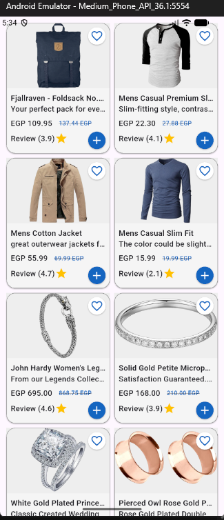

# Elevate Filtration Task Solve

## Architecture

- MVVM
- Cubit (BLOC)
- Repository Patter
- API (dio)

## API

- [Api: fake store api link]
<https://fakestoreapi.com/products>

## ScreenShots

## How to run

- flutter pub get
- flutter run
